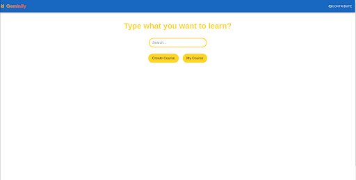

# Geminify - AI-Powered Course Creator

Geminify is an innovative platform that leverages the power of Google's Gemini AI to create personalized courses on any topic. With interactive quizzes and certification features, it offers a unique learning experience tailored to each user.

## Features

- **AI Course Generation**: Create courses on any topic using Gemini AI
- **Interactive Quizzes**: Test your knowledge with AI-generated quizzes
- **Certification**: Earn certificates upon successful course completion
- **Course Saving**: Save up to one course at a time for continued learning
- **YouTube Integration**: Enhance learning with relevant video content

## Screenshots

### Home Page

### Course Creation

### Quiz Interface

### Certificate Generation

## Tech Stack

- [Nuxt 3](https://nuxt.com/) - The Intuitive Vue Framework
- [Vue.js](https://vuejs.org/) - The Progressive JavaScript Framework
- [Google Gemini AI](https://deepmind.google/technologies/gemini/) - Advanced AI model for content generation
- [YouTube Data API](https://developers.google.com/youtube/v3) - For fetching relevant educational videos

## Setup and Installation

1. Clone the repository:
git clone https://github.com/walleeva2018/GeminiDev
cd GeminiDev
Copy
2. Install dependencies:
npm install

3. Set up environment variables:
Create a `.env` file in the root directory and add:
GOOGLE_AI_API_KEY=your_gemini_ai_api_key
YOUTUBE_API_KEY=your_youtube_api_key

4. Run the development server:
npm run dev

5. Open `http://localhost:3000` in your browser

## Building for Production
npm run build

## Contributing

We welcome contributions to Geminify! 

## License

This project is licensed under the [MIT License](LICENSE).

## Acknowledgements

- Google Gemini AI Team
- Nuxt.js Team
- All our contributors and users

---

Created with ❤️ for the Google Gemini AI Competition